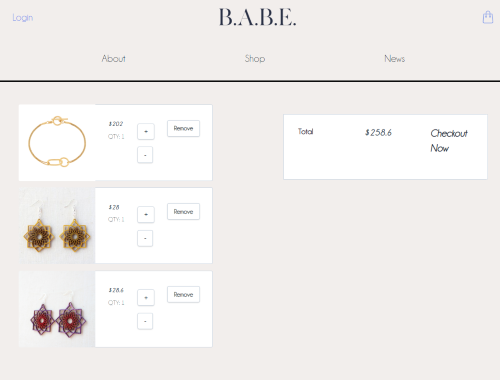

# BABE

A MERN Eccomerce site promiting womans products, news, and health

## Motivation

An Ecommerce site allowing women and women idetifying buissness owenrs and entrepenuers a platform to showcase their products.

## Build status

Curently deployed: build status failed

## Code style

React App utilizing JavaScript

## Screenshots

Shopping:


Cart Display:



News:


## Tech/framework used

Ex. -

<b>Built with</b>

- [Create React App](https://github.com/facebook/create-react-app).
- [tailwindcss](https://tailwindcss.com/)

## Installation

After cloning this repo:

```
npm install
```

```
npm start
```

```
cd client
```

```
npm start
```

Server to run on localhost 3001
Client to run on localhost 3000.

## API Reference

- [New York Times](https://www.nytimes.com/)

## Contribute

Pull requests are welcome. For major changes, please open an issue first to discuss what you would like to change.

Please make sure to update tests as appropriate.

## Credits

- [Izzy](https://github.com/iedson)
- [Jo](https://github.com/joannasowa19)
- [Oriana](https://github.com/orianacd)

## License

MIT © [hchamorro]()
